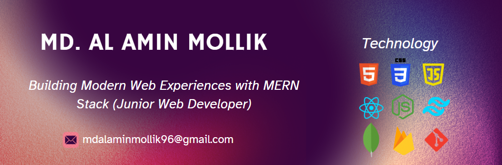

<h1 align="center">Hi 👋, I'm Md. Al Amin Mollik</h1>
<h3 align="center">Junior Web Developer | Mastering React.js | Crafting Code with Precision and Creativity</h3>  

 
  
  
  <a href="https://salesp07.github.io" target="_blank">
      <!-- sqlite, safari, google-chrome are other good icon options -->
  </a>

  

#### Hello, I'm Md. Al Amin Mollik, a passionate junior web developer with expertise in the MERN stack - React.js, Node.js, Express.js, and MongoDB. My journey in the world of technology is fueled by a relentless passion for crafting seamless and user-centric web experiences.

## 🚀 What Drives Me
#### I thrive on challenges and take pride in being a hard worker and quick learner. My commitment to staying on the cutting edge of technology drives my eagerness to embrace new tools and methodologies. I believe in continuous learning as the key to innovation.

## 🌐 Technologies I Work With
#### My proficiency extends to HTML, CSS, JavaScript, reactJs, NodeJs , Firebase and many more, allowing me to build robust and scalable applications. Beyond code, I am fascinated by the potential of technology to transform lives.

## 💡 My Aspirations
 #### Currently, I am updating my skills and aspiring to contribute to the tech landscape on a global scale. My ultimate goal is to secure a challenging position with a leading organization, such as Google, where I can continue to grow as a developer and contribute to cutting-edge projects. I am excited about the opportunity to be part of a forward-thinking team that values creativity and excellence in web development.
 
 <li>I’m exploring - now Typescript & SASS.</li>
<li>I’m looking forward - To gain industry-level experience to work on a quality full organization.</li>
<li>I’m trying - To develop my skills -and collaborate any open-source project.</li>

<h2 align="center">💻 Technologies that I know</h2>

 

     

<h2 align="center">⚔ Some Tools That I know</h2>
     

<h2 align="center">📊 Current Stats</h2>
 

  

 
  
   
 
  
  

 
 

  <h2>🥇 My Contributions </h2>
  
  
  
   

