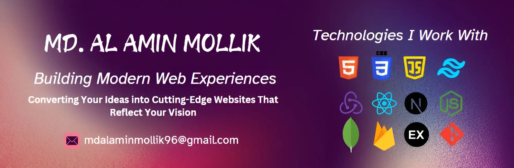

<h1 align="center">Assalamu Alaikum,   
I'm Md. Al Amin Mollik</h1>
<h3 align="center">MERN Stack Web Developer | Transforming Your Ideas Into Exceptional Digital Experiences</h3>  

 
  
  
  <a href="https://protfolioofalamin.netlify.app" target="_blank">
      <!-- sqlite, safari, google-chrome are other good icon options -->
  </a>

  

#### As a passionate web developer with a strong background in the MERN stack—React.js, Next.js, Node.js, Express.js, and MongoDB—I thrive on turning ideas into impactful digital experiences. My journey in technology is driven by a genuine love for creating user-friendly and engaging modern websites that make a difference.

## 🚀 My Source of Inspiration

#### I love diving into new challenges and take pride in my hard work and ability to learn quickly. I'm genuinely excited about technology and always eager to try out new tools and techniques. For me, continuous learning isn’t just a necessity; it’s what keeps me passionate and innovative in this ever-changing field.

## 🌐 Technologies I Work With

#### I’m skilled in HTML, CSS, Tailwind CSS, JavaScript, React.js, Next.js, Node.js, Express.js, Redux, JWT Authentication, Firebase, and a range of UI component libraries, which empowers me to build dynamic and scalable applications. But what really drives me is the incredible potential of technology to create meaningful change and enhance lives in ways that go beyond just coding.

<li>
I am currently serving as a Webmaster at CoderSquads.
</li>

<h2 align="center">💻 Technologies that I know</h2>

 

     

<h2 align="center">⚔ Some Tools That I know</h2>
     

<h2 align="center">📊 Current Stats</h2>
 

  

  

    
    

 
 

  <h2>🥇 My Contributions </h2>
  
  
  
   

