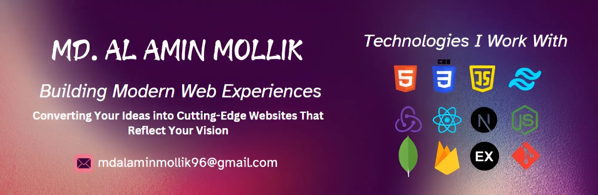

  <h1>Assalamu Alaikum! 👋</h1>
  <h3>Full Stack Developer | Building Scalable, High-Performance Web Applications</h3>
  

 

  
  
  

 

## 👨‍💻 Professional Overview

I am a Full-Stack Developer specializing in the modern web ecosystem, distributed architecture, and e-commerce infrastructure. I focus on bridging technical execution with overarching business goals—managing the entire software lifecycle from NoSQL schema design and secure API routing to server provisioning and edge caching.

### 💼 Work Experience

- **CoderSquad** | _Full-Stack Software Engineer & Webmaster_ (Aug 2024 - Present)
  - Architecting and scaling robust MERN stack applications with a heavy emphasis on TypeScript.
  - Managing production-ready infrastructure using Linux VPS, Dokploy, CI/CD pipelines, and Cloudflare.
  - Engineering complex hybrid architectures, integrating custom Node.js microservices to bypass native CMS constraints.
- **Independent Clients** | _Freelance Full-Stack Developer_ (2023 - Present)
  - Delivering end-to-end custom web solutions, SaaS platforms, and secure multi-tenant ecosystems.
  - Engineering custom data scrapers and optimizing Core Web Vitals to 95+ for SEO-heavy enterprise clients.
- **Academics** | _B.Sc. in Computer Science & Engineering_ (Ongoing)
  - Balancing rigorous academics with full-time enterprise engineering. Focusing on system design, advanced data structures, and algorithms, while actively applying these theoretical concepts to solve real-world production challenges.

---

## 🛠️ Technical Arsenal

  
  ### 💻 Frontend Development
  
  
  
  
  
  ### ⚙️ Backend & Databases
  
  
  
  
  
  
  
  

### 🛒 CMS & E-Commerce

  
  
  
  
  

### 🔐 Architecture & Security

  
  
  
  
  
  
  

### 🌐 Infra & DevOps

  
  
  
  
  

### 🧰 Tools & Languages

  
  
  

---

## 🌍 Languages & Interests

<table>
  <tr>
    <td valign="top" width="50%">
      <h3>🗣️ Languages</h3>
      <ul>
        <li>🇧🇩 <b>Bangla:</b> Native</li>
        <li>🇬🇧 <b>English:</b> Professional Working Proficiency</li>
        <li>🇮🇳 <b>Hindi:</b> Conversational (Listening & Speaking)</li>
      </ul>
    </td>
    <td valign="top" width="50%">
      <h3>🎯 Interests</h3>
      <ul>
        <li>🛡️ <b>CyberSecurity:</b> Web Vulnerability Mitigation & InfoSec</li>
        <li>🤖 <b>AI/ML Engineering:</b> Building foundational models, Neural Networks, and Deep Learning architectures.</li>
        <li>🏗️ <b>Scalable System Architecture:</b> Distributed systems & high-performance design</li>
      </ul>
    </td>
  </tr>
</table>

---

## 🚀 Engineering Highlights

_Because much of my enterprise agency work is proprietary, here is a high-level look at the architecture I build:_

| 🌍 Cross-Border E-Commerce                                                                                         | 🛒 Enterprise Shopify Migration                                                                                     | 💼 B2B Multi-tenant ERP                                                                                         |
| :----------------------------------------------------------------------------------------------------------------- | :------------------------------------------------------------------------------------------------------------------ | :-------------------------------------------------------------------------------------------------------------- |
| **Type:** Scalable E-commerce                                                                                      | **Type:** Hybrid Architecture                                                                                       | **Type:** Enterprise SaaS                                                                                       |
| **Architecture:** Built a massive infrastructure handling complex international logistics and secure transactions. | **Architecture:** Engineered a standalone Node.js microservice backend integrated with custom Shopify Apps.         | **Architecture:** Next.js & Node.js hybrid featuring atomic POS terminal logic and immutable financial ledgers. |
| **Scale:** Dynamic pricing algorithms, high-concurrency traffic handling, and secure payment gateways.             | **Scale:** Successfully bypassed strict native CMS limits for dynamic product variants and massive 70+ field forms. | **Scale:** Designed for strict Role-Based Access Control (RBAC) and real-time organizational data tracking.     |

_(For a deep dive into my work and detailed case studies, visit my [Interactive Portfolio](https://alaminmollik.vercel.app))._

---

## 📊 GitHub Analytics

  
  
    
  
   
  
    
  

---

## 🐍 Contribution Graph

  

 

  <i>"Great software is not just written; it is architected for change, built for scale, and engineered for the user."</i>

